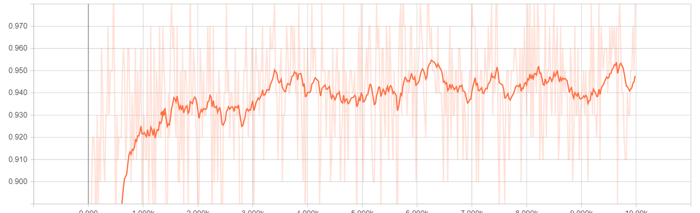

# Simple-MNIST-Classifier
Simple MNIST digit classifier using a softmax regressor on Tensorflow.

Materials and Methods:
The MNIST digit classifer was trained using a cross entropy error metric on 10000 epochs.

Data:
Graph of accuracy over epochs visualized using Tensorboard. As the algorithm trains, the accuracy slowly increases.
</img>

References:
“MNIST For ML Beginners.” TensorFlow, Google Brain, 17 Aug. 2017, www.tensorflow.org/get_started/mnist/beginners.
